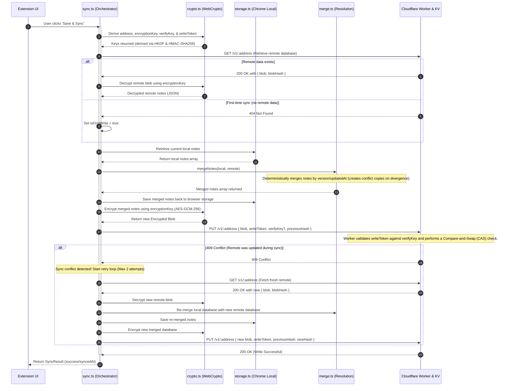

# Note It Down 📝


A note-taking Chrome Extension that leverages the modern **Document Picture-in-Picture (PiP)** API to create floating, borderless, always-on-top text editors.

## Features
- **Floating PiP Editor**: Instantly pop out any note into a native, always-on-top Picture-in-Picture window.
- **Themed Aesthetic**: A fully themed light and dark mode UI.
- **Shadow DOM Isolation**: The popup launcher is injected directly into the webpage using an isolated Shadow DOM, completely shielding it from aggressive CSS bleeding on strict sites like Reddit.
- **Zero Distractions**: The PiP editor strips away borders, headers, and footers to provide a 100% full-bleed, immersive writing canvas.
- **Offline First**: All notes are stored locally in Chrome's storage. No internet required.
- **Zero-Knowledge Sync**: Opt-in, end-to-end client-side encrypted sync (AES-GCM 256-bit) via a self-hosted Cloudflare Worker KV relay.

## Installation (Developer Mode)

1. Clone this repository.
2. Install dependencies: `pnpm install`
3. Build the extension: `pnpm build`
4. Open Chrome and navigate to `chrome://extensions/`
5. Enable **Developer mode** in the top right corner.
6. Click **Load unpacked** and select the `dist` folder inside this project.
7. Pin the extension to your toolbar and click the icon to open the launcher!

## 🧩 Powered by `pip-it-up`
This extension was built to showcase how effortlessly you can wrap any React component in a native PiP window using the `@pip-it-up/react` library. 

Here is the exact code snippet from our `EditorOverlay.tsx` showing the controlled implementation of `<PipWrapper>`:

```tsx
import { PipWrapper } from '@pip-it-up/react'

// ...inside the component...

<PipWrapper
  width={380}
  height={360}
  open={activeNoteId !== null}
  onOpenChange={(openState) => {
    if (!openState) {
      setActiveNoteId(null)
    }
  }}
  placeholder={<div style={{ display: 'none' }} />}
>
  {activeNoteId && (
    <NoteEditor
      key={activeNoteId}
      noteId={activeNoteId}
      onClose={() => setActiveNoteId(null)}
      theme={theme}
    />
  )}
</PipWrapper>
```

---

## ☁️ Zero-Knowledge Sync Layer (Optional)

*Note It Down* includes an opt-in, end-to-end encrypted sync system. Your notes are encrypted client-side using derived AES-GCM keys before leaving the device. Sync runs through a **user-deployed** Cloudflare Worker, meaning you own 100% of your data and credentials.

For full configuration and deployment steps, see the **[sync-worker/README.md](sync-worker/README.md)** (or absolute path **[sync-worker/README.md](file:///Users/saurabhshakya/Documents/Projects/note-it-down/sync-worker/README.md)**).

### How Zero-Knowledge Cryptography Works

To achieve complete privacy, the extension employs a zero-knowledge structure using WebCrypto APIs:
1. **Deterministic Key Derivation (HKDF)**: From your single raw sync token, the extension derives three independent cryptographic values via HKDF-SHA-256 (using a fixed 32-byte zero salt):
   - `address`: The database lookup key (used as the URL segment on the worker).
   - `encryptionKey`: An AES-GCM 256-bit key used locally to encrypt/decrypt note database payloads.
   - `verifyKey`: Stored on the worker during the first sync to authenticate future writes.
2. **Write Token Derivation (HMAC)**: A `writeToken` is derived by computing an HMAC-SHA256 signature of `"nid-write-auth"` using the derived `verifyKey` bytes as the key.
3. **Zero-Knowledge Boundary**: The client only transmits the `address`, the `writeToken`, and the encrypted `blob` (plus `verifyKey` on first write). The `encryptionKey` and the raw `token` **never leave your device**.
4. **Worker Verification**: The worker verifies subsequent writes by re-computing the HMAC signature using the stored `verifyKey` and comparing it to the incoming `writeToken`. The worker is content-blind (cannot read notes) and token-blind (does not know the raw token).



### Why Cloudflare Workers & KV?
Deploying your own worker provides a powerful backend with zero overhead:
- **100% Private & Self-Hosted**: No accounts, no database hosting, and zero visibility of your notes by anyone (including Cloudflare, as all blobs are client-side encrypted).
- **Generous Free Tier**: Cloudflare's free tier is more than enough for personal note-taking:
  - **Storage**: Up to **1 GB** of free data in Cloudflare KV (equivalent to hundreds of thousands of notes).
  - **Requests**: **100,000 free requests** per day.
  - **KV Operations**: **100,000 read** operations and **1,000 write/delete** operations per day for free. (Assuming you sync 2-3 times a day, you will use less than 1% of the free tier).
- **Global Speed**: Runs on Cloudflare's edge network, meaning sync is fast and responsive from any location.

---

## 🚀 Technical Challenges & Solutions

Building a Chrome extension that blends the Document Picture-in-Picture API with React 19, Vite, and injected content scripts introduced several browser security and lifecycle boundaries. Here is how we tackled them:

| Challenge | Browser Policy / Security Boundary | The Problem | How We Tackled It (Solution) |
| :--- | :--- | :--- | :--- |
| **1. Sandboxed Extension Frame** | Extensions block `documentPictureInPicture` in popups and side panels. | `requestWindow()` throws security exceptions in default extension frames. | Migrated the extension UI into a webpage-injected sidebar drawer panel. |
| **2. Gesture Token Expiration** | Document PiP requires a direct, synchronous user gesture (e.g. click). | Async message passing (popup → content script) expires the user click token. | Rendered the UI directly in host DOM so user clicks act as native webpage gestures. |
| **3. Content Security Policy (CSP)** | Secure host pages block lazy-loaded script chunks. | Dynamic chunk loading causes CSP violations on sites like GitHub/Google. | Configured Vite to bundle the content script into a single, standalone IIFE script. |
| **4. CSS Style Sheet Isolation** | Content scripts run in isolated worlds invisible to host stylesheets. | Copying `document.styleSheets` inside PiP yields empty unstyled HTML. | Injected the extension's absolute CSS URL directly into the PiP window `<head>` on load. |
| **5. Theme Scoping & Bleed** | Floating PiP window runs in a separate root document context. | Browser default PiP background causes unstyled margins and layout clutter. | Dynamically repainted the PiP body background and hid headers/footers for full-bleed viewport. |
| **6. Host CSS Bleeding** | Host page global stylesheets reset/infect injected elements. | Host resets (like Reddit) break layout and alignments in the launcher. | Encapsulated the React app's mounting root inside an isolated **Shadow DOM**. |
| **7. Server-Blind Sync Auth** | Server must validate writes without access to raw credentials or data. | Storing tokens on-server breaks the zero-knowledge privacy model. | Used HKDF to derive separate keys; verified write tokens via HMAC of a verify key. |
