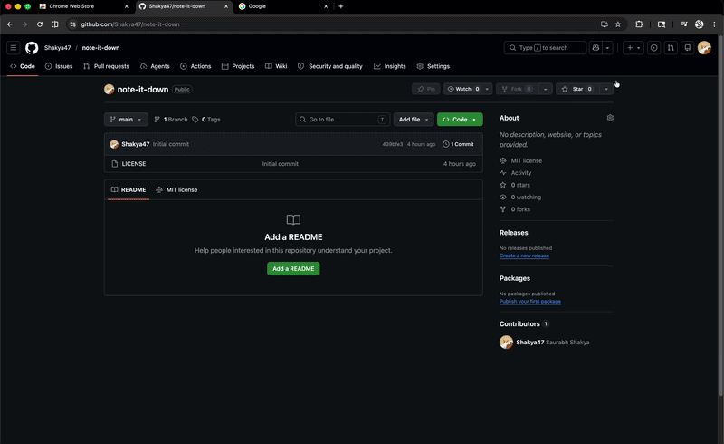

# Note It Down 📝



A note-taking Chrome Extension that leverages the modern **Document Picture-in-Picture (PiP)** API to create floating, borderless, always-on-top text editors.

## Features
- **Floating PiP Editor**: Instantly pop out any note into a native, always-on-top Picture-in-Picture window.
- **Themed Aesthetic**: A fully themed light and dark mode UI.
- **Shadow DOM Isolation**: The popup launcher is injected directly into the webpage using an isolated Shadow DOM, completely shielding it from aggressive CSS bleeding on strict sites like Reddit.
- **Zero Distractions**: The PiP editor strips away borders, headers, and footers to provide a 100% full-bleed, immersive writing canvas.
- **Offline First**: All notes are stored locally in Chrome's storage. No internet required.

## Installation (Developer Mode)

1. Clone this repository.
2. Install dependencies: `pnpm install`
3. Build the extension: `pnpm build`
4. Open Chrome and navigate to `chrome://extensions/`
5. Enable **Developer mode** in the top right corner.
6. Click **Load unpacked** and select the `dist` folder inside this project.
7. Pin the extension to your toolbar and click the icon to open the launcher!

## 🧩 Powered by `pip-it-up`
This extension was built to showcase how effortlessly you can wrap any React component in a native PiP window using the `@pip-it-up/react` library. 

Here is the exact code snippet from our `EditorOverlay.tsx` showing the controlled implementation of `<PipWrapper>`:

```tsx
import { PipWrapper } from '@pip-it-up/react'

// ...inside the component...

<PipWrapper
  width={380}
  height={360}
  open={activeNoteId !== null}
  onOpenChange={(openState) => {
    if (!openState) {
      setActiveNoteId(null)
    }
  }}
  placeholder={<div style={{ display: 'none' }} />}
>
  {activeNoteId && (
    <NoteEditor
      key={activeNoteId}
      noteId={activeNoteId}
      onClose={() => setActiveNoteId(null)}
      theme={theme}
    />
  )}
</PipWrapper>
```

---

# Chrome Extension Document Picture-in-Picture: Technical Challenges & Solutions

This section acts as a comprehensive technical post-mortem for the **Note It Down** Proof of Concept. It details the core browser policies, security boundaries, and async state hurdles we faced when building a Picture-in-Picture (PiP) enabled React extension, and how we engineered our way around them.

---

## 🚀 The Core Architectural Goal
To build a Chrome extension that allows users to click a note in a list and have the note editor float instantly in an **always-on-top, borderless Document Picture-in-Picture (PiP) window** using React 19, Vite, and `@pip-it-up/react`.

---

## 🚧 Challenge 1: The Sandboxed Extension Security Boundary
### The Problem
Initially, we planned to host the note list inside standard Chrome extension contexts like the **Popup panel** (toolbar click) or the **Side Panel** (`chrome.sidePanel`). 
* **Roadblock**: Chrome strictly blocks the Document PiP API (`documentPictureInPicture.requestWindow()`) inside extension popup and side panel contexts. Attempting to call it from these frames instantly throws an error:
  > *Uncaught (in promise) TypeError: documentPictureInPicture.requestWindow is not a function* or *SecurityError: Disallowed in this context.*
* **Why?** Chrome isolates extension popups/panels. Since they do not run inside a standard webpage tab context, they are strictly sandboxed from launching floating OS-level window containers.

### How We Tackled It
We completely abandoned the side panel and popup HTML layout. 
* **The Solution**: We migrated the entire list UI into a **webpage-injected sidebar drawer panel** inside the active tab. 
* Clicking the extension icon now triggers a background service worker to send a message to a lightweight, dynamic content script IIFE. The script mounts a persistent sliding drawer directly into the host webpage's DOM. 

---

## ⚡ Challenge 2: Asynchronous User Gesture Expiration
### The Problem
To open a Document Picture-in-Picture window, Chrome mandates a **direct, synchronous user gesture** (such as a physical click handler). 
* **Roadblock**: If the note list is in the extension popup and you click a note:
  1. User clicks item in popup.
  2. Popup sends a message to the content script (`chrome.tabs.sendMessage`).
  3. Content script receives the message asynchronously.
  4. Content script attempts to call `documentPictureInPicture.requestWindow()`.
  * **Result**: The browser blocks the request with:
    > *SecurityError: Must be handling a user gesture to use picture-in-picture.*
  * **Why?** The asynchronous message passing boundary completely destroys Chrome's temporary user gesture token, making the click invalid by the time the script receives it.

### How We Tackled It
* **The Solution**: By injecting the sliding sidebar drawer directly into the webpage's DOM, **every click on the drawer list is a direct webpage user gesture!**
* When the user clicks **✨ New Note** or a note item inside our sliding drawer, we trigger the `<PipWrapper>` element's state synchronously inside the click callback. Since the click takes place inside the host tab's DOM, the user gesture token remains intact, enabling **100% direct, single-click Picture-in-Picture openings**!

---

## 🛡️ Challenge 3: Host Page Content Security Policies (CSP)
### The Problem
Highly secure sites (such as `google.com`, `github.com`, or `chromewebstore.google.com`) have strict Content Security Policies that block dynamic script imports or external script evaluation.
* **Roadblock**: Standard extension builders bundle content scripts with multiple lazy-loaded dynamic code splitting chunks (e.g. `import()`). When injected on secure sites, the browser blocks these chunk imports, throwing a CSP violation and causing the content script to crash immediately on DOM mount.

### How We Tackled It
* **The Solution**: We restructured the Vite build process in `vite.content.config.ts`.
* We configured the content script builder to output the entire environment (React 19, styling, list handlers, and the editor) into a **single standalone classic IIFE (Immediately Invoked Function Expression) bundle** with zero dynamic import statements. This single bundled script executes flawlessly on even the most secure sites.

---

## 🎨 Challenge 4: Stylesheet Losses Across Isolated Worlds
### The Problem
Chrome inserts content stylesheets inside an **isolated world** so extension styles do not pollute or conflict with the host page.
* **Roadblock**: Stylesheets inserted via `chrome.scripting.insertCSS` or dynamic script tags do not appear in the host document's `document.styleSheets` list. 
* Because the `@pip-it-up/react` engine relies on copying elements from `document.styleSheets` into the new PiP window's `<head>`, it copied an empty list, causing the floating note editor to lose its themes, custom scrollbars, and borders, rendering with raw unstyled HTML.

### How We Tackled It
* **The Solution**: Inside the `NoteEditor.tsx` component, we wrote a `useEffect` that listens for the floating PiP window's birth.
* When active, it directly queries the newly created window context: `(window as any).documentPictureInPicture.window`.
* It fetches the absolute extension URL of the compiled standalone style sheet: `chrome.runtime.getURL('content.css')` (granted access via `web_accessible_resources` in `manifest.json`).
* It appends a custom `<link rel="stylesheet">` straight into the PiP window document's `<head>`, immediately mapping all coordinates, animations, and styling.

---

## ☀️ Challenge 5: Dynamic Theme Scoping & Window Bleeding
### The Problem
The floating PiP window is rendered inside a separate browser document window context, meaning it has a separate `:root` element.
* **Roadblock 1**: The browser's default background for empty PiP windows is a dark charcoal color. If the user had the Light Theme enabled in their sidebar, the note editor elements rendered in light cream while surrounded by a thick, raw, unstyled dark browser frame margin.
* **Roadblock 2**: The PiP window carried header titles, close actions, and saving footers which cluttered the distraction-free window.

### How We Tackled It
* **The Solution 1 (Real-time Color Sync)**: We passed the active drawer's `theme` (`light` vs `dark`) down as a React prop to `<NoteEditor>`. Inside `NoteEditor`, the PiP lifecycle `useEffect` dynamically targets the PiP window's `body` element style:
  ```typescript
  const themeBgColor = theme === 'dark' ? '#2E303C' : '#FFFBF0'
  pipWindow.document.body.style.backgroundColor = themeBgColor
  ```
  This immediately repaints the window body background frame to match the active theme, leaving absolutely zero flash or unstyled margins.
* **The Solution 2 (Clean Full-Bleed Viewport)**: When rendering inside the PiP window (`isInsidePip = true`), we conditionally omitted both the `<header>` and `<footer>` elements entirely. 
* We stripped out the card borders and rounded corners, creating a **borderless, 100% full-bleed viewport** containing only the text title and description text area, yielding a minimal, distraction-free writing environment.

---

## 🛡️ Challenge 6: Aggressive Host Page CSS Bleeding (e.g., Reddit)
### The Problem
When injecting the React application directly into `document.body`, the extension's UI is vulnerable to global CSS resets applied by the host page.
* **Roadblock**: Highly styled sites like Reddit use aggressive global CSS rules (such as `box-sizing`, `margins`, or setting `div { height: 100% }`). These rules bled directly into our extension's popup launcher, stretching the drawer, misaligning elements, and destroying the carefully crafted layout.

### How We Tackled It
* **The Solution**: We migrated the entire root mount of the extension into a **Shadow DOM**. 
* By attaching an open shadow root (`container.attachShadow({ mode: 'open' })`) and mounting our React app inside it, we created an impenetrable CSS boundary.
* To style the UI inside this boundary, we dynamically injected our `content.css` `<link>` directly into the shadow root.
* We updated CSS pseudo-classes (adding `:host` alongside `:root`) to ensure our global CSS variables were properly scoped. This completely isolated our extension, ensuring perfect pixel-for-pixel rendering regardless of the host website's CSS.

---

## 📈 Summary of Engineering Triumphs

| Roadblock | Security / Policy Constraint | Architectural Triumph |
| :--- | :--- | :--- |
| **Sandboxed Frame Blocker** | PiP blocked in popup/sidepanel frames | Injected drawer directly into host webpage DOM |
| **Gesture Expiration Blocker** | Async boundaries destroy user gesture token | Synchronous Controlled State trigger inside DOM click handlers |
| **Host CSP Violations** | Highly secure sites block dynamic script loads | Classic IIFE bundles with zero lazy-loaded script chunks |
| **Isolated World Style Loss** | Extension CSS invisible to page stylesheet list | Direct absolute URL injection into `documentPictureInPicture.window` head |
| **PiP Visual Clutter** | Double outlines, headers, footers in tiny windows | Conditional omit of headers/footers + borderless full-bleed viewports |
| **Host CSS Bleeding** | Global resets destroy injected UI layout | Encapsulated React mount inside an isolated **Shadow DOM** |
